## Tech Stack

- Client: React Native + Tauri (all-platform framework)
- Server: FastAPI

## Data Flow

- A message file can be created or moved in `resources/`, `dialogues/`, `artifacts/` via UI:
  - a single message without requesting an AI response will be saved in `resources/`
  - if user requests an AI response later, a resource message will be moved to `dialogues/`
  - if user needs to revise a message frequently, it can be moved to `artifacts/`, similar to "Canvas" in ChatGPT or "Document" in Claude

```mermaid
graph TD
    subgraph User Interface
        direction LR
        A["Client App (Desktop/Mobile)"]
    end

    subgraph Core Local Backend
        direction TB
        B1["File System (Chamber&Dialogues as Folders)"]
        B2["Git Service (isomorphic-git / libgit2) Handles Commits, Branches, History"]
        B1 -- "Reads/Writes MD Files" --> A
        A -- "Executes Git Commands" --> B2
        B2 -- "Manages .git Repos" --> B1
    end

    subgraph Backend Services
        direction TB
        C1["Search Service"]
        subgraph C1_sub [" "]
            direction LR
            C1a["Full-Text Index (e.g., Meilisearch, Lunr.js)"]
            C1b["Vector Store (e.g., pgvector, Qdrant, local Faiss)"]
        end
        C1 --- C1_sub

        D["Background Worker / Scheduler"]

        E["AI Service Abstraction Layer"]
    end

    subgraph External Dependencies
        direction TB
        F["Cloud AI APIs (OpenAI, Claude, etc.)"]
        G["External Data APIs (Readwise API)"]
        H["Sync Service (e.g., GitHub, Self-hosted Gitea)"]
    end

    %% --- Connections & Data Flow ---

    %% User Actions
    A -- "User Query / Edit / Save" --> B1
    A -- "User Search Query" --> C1
    A -- "Ask AI / Summarize" --> E

    %% AI Service Flow
    E -- "Generates Embeddings" --> C1b
    E -- "Sends Prompts" --> F
    F -- "Returns Completions" --> E
    E -- "Returns AI Response" --> A

    %% Search & RAG Flow
    C1 -- "Returns Search Results" --> A
    E -- "1. Retrieves Context (RAG)" --> C1

    %% Background Worker Flow
    D -- "Monitors Screenshot Folder" --> B1
    D -- "Periodically Fetches Data" --> G
    D -- "Fetches Webpage Content" --> B1
    D -- "Performs OCR / Processing" --> B1
    D -- "Generates Embeddings for New Content" --> C1b
    D -- "Updates Full-Text Index" --> C1a

    %% Sync Flow
    B2 -- "Push/Pull for Sync" --> H

    %% Style Definitions
    classDef client fill:#D5E8D4,stroke:#82B366,stroke-width:2px;
    classDef local_backend fill:#DAE8FC,stroke:#6C8EBF,stroke-width:2px;
    classDef services fill:#E1D5E7,stroke:#9673A6,stroke-width:2px;
    classDef external fill:#FFE6CC,stroke:#D79B00,stroke-width:2px;

    class A client;
    class B1,B2 local_backend;
    class C1,D,E services;
    class F,G,H external;
```



## FIle System Structure

```
/my-chamber/
  chamber.json
  .ruminer/
    tags.json  # tags for messages (topics, archived, pinned, etc. can be auto attached)
    links.json  # links between messages
    groups.json  # groups of messages (can be nested, can be automated by rules)
    reminders.json  # reminders for messages
    rules.json  # rules for groups, reminders, links, tags, etc.
    /hooks/  # webhooks, API integration, etc.
        readwise.json  # readwise webhook
        notion.json  # notion webhook
        youtube.json  # youtube webhook (fetch transcript)
        preprocess.json  # preprocess webhook (clean, parse, tag, etc.)
        export.json  # publish blogs, export to notion, etc.
  resources/  # notes, images, highlights, documents... (single messages with no response)
    .git/
    simple-note.md  # simple note
    book-highlight.md  # highlight
    transcript.md  # video/audio transcript
    image.png  # image
    document.pdf  # document
  dialogues/
    hello-world/
      .git/
      meta.json
      20250623-100501.md
      20250623-100701.md
  artifacts/  # long messages in multiple revisions (blogs, plans, docs, etc.) (can be in collaboration with AI and others)
    .git/
```

## Data Model

📦 chamber.json (Top-Level Overview)

```json
{
  "name": "my-chamber",
  "created_at": "2025-06-23T00:00:00Z",
  "description": "My knowledge vault for Ruminer",
  "structure": {
    "resources_path": "./resources/",
    "dialogues_path": "./dialogues/",
    "artifacts_path": "./artifacts/",
    "system_path": "./.ruminer/"
  },
  "stats": {
    "message_count": 1205,
    "dialogue_count": 34,
    "resource_count": 210,
    "tag_count": 56,
    "group_count": 14,
    "reminder_count": 21
  }
}
```

⸻

📚 /resources/ (Atomic Notes, Highlights, Images, Transcripts)

Each file is a standalone message with no expected AI response. Optionally, each Markdown file has frontmatter metadata.

Example: transcript.md

```markdown
---
id: 20250622-141201
title: "Taleb on Antifragile"
source: "youtube"
tags: ["highlight", "book/Antifragile"]
created_at: "2025-06-22T14:12:01Z"
---

The antifragile thrives on volatility...
```

⸻

💬 /dialogues/ (Conversational Threads with Git History)

Each dialogue is a Git folder with Markdown messages. Example: dialogues/hello-world/

meta.json

```json
{
  "id": "20250623-100500",
  "title": "Hello World Dialogue",
  "created_at": "2025-06-23T10:05:00Z",
  "tags": ["project", "ai"],
  "branches": ["main", "experiment"]
}
```

Each message like 20250623-100501.md can include:

```markdown
---
id: 20250623-100501
author: user
timestamp: 2025-06-23T10:05:01Z
reply_to: null
tags: ["project", "init"]
reminder: 2025-06-30
source: "user"
---

Let's design Ruminer’s architecture...
```

⸻

🧾 /artifacts/ (Collaborative Documents)

Long-form documents (plans, essays, blog posts) tracked via Git. Supports multiple contributors and AI assistance.

E.g., 20250601-095832.md:

```markdown
---
id: 20250601-095832
title: "Why Ruminer Must Exist"
created_at: "2025-06-01T09:58:32Z"
status: "draft"
collaborators: ["tz", "ai"]
tags: ["manifesto", "philosophy"]
---

The age of fragmented digital thinking must end...
```
